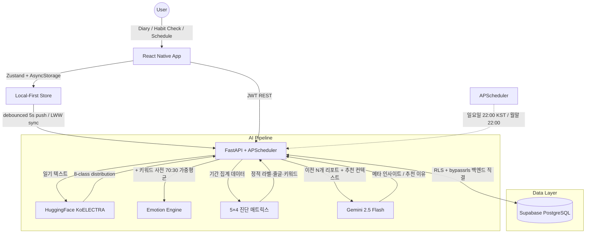

# HABITS 🧘‍♀️
> **Psychology-based Personalized Habit Coaching Service with AI**
> 심리 이론 기반의 자아 탐색과 AI 감정 분석을 통한 개인 맞춤형 습관 코칭 서비스

[]()
[]()
[-336791?logo=postgresql)]()
[]()
[]()

---

## 📖 Project Overview

**"무작정 따라 하는 습관이 아닌, '나'를 이해하고 성장시키는 습관 코칭"**

**HABITS**는 사용자의 심리적 성향, 일과 스케줄, 매일의 감정 상태를 통합 분석해 **'이상적인 나'로 나아가는 과정**을 돕는 AI 기반 습관 코칭 모바일 앱입니다. 단순 체크리스트를 넘어, 행동(이행률)과 감정의 교차분석으로 *왜 안 됐는지* 까지 진단해 다음 액션을 제안합니다.

### 🎯 Key Goals
- **Self-Discovery** — 36개 해시태그 기반 성격 테스트로 '현재의 나' ↔ '이상적인 나' 격차 파악
- **Context-Aware Recommendation** — 사용자가 입력한 일주일 스케줄을 기반으로 Gemini가 습관별 최적 시간대 자동 매핑
- **Emotion-Aware Feedback** — KoELECTRA 8-class 감정 분류 + 한국어 키워드 사전으로 일기 분석, 행동/감정 교차 진단을 주·월간 리포트로 제공
- **Mood × Habit Insight** — 누적된 일기 mood_score와 습관 로그를 교차 분석해 "컨디션과 함께 가는 습관" / "회복 루틴" 자동 도출
- **Closed Feedback Loop** — 리포트 만족도 평가 → 다음 리포트 톤/Gemini 호출 분기에 자동 반영

---

## 🛠 Tech Stack

| Category | Technology | Notes |
| :--- | :--- | :--- |
| **Mobile** | React Native 0.84 + TypeScript | iOS·Android 단일 코드베이스 |
| **State** | Zustand + persist + AsyncStorage | Local-First 저장소 |
| **Navigation** | React Navigation Native Stack | |
| **Icons** | lucide-react-native + react-native-svg | 폰 이모지 → 픽토그램 |
| **Gesture** | react-native-gesture-handler (Swipeable) | 습관 토글 스와이프 |
| **Backend** | FastAPI 0.104 (Python 3.12) + APScheduler | 자동 리포트 스케줄러 |
| **DB** | PostgreSQL via Supabase (Session Pooler) | RLS + 권한 회수로 PostgREST 노출 차단 |
| **ORM** | SQLAlchemy 2.0 + Alembic | |
| **Auth** | JWT (HS256, access 15분 + refresh 7일) + bcrypt cost 12 | refresh race-lock 적용 |
| **AI #1** | **KoELECTRA** (`monologg/koelectra-base-v3-discriminator`, HF Inference API) | 8-class 감정 분류 (AI Hub 감성 대화 말뭉치 파인튜닝) |
| **AI #2** | **Gemini 2.5 Flash** | 시계열 메타 인사이트, 추천 이유 개인화, 일정 기반 time_slot 배정 |
| **Mail** | Resend API | 비밀번호 재설정 |

---

## 🏗 System Architecture



---

## 🧠 Core Logic

### 1. 감정 분석 (KoELECTRA)
한국어 ELECTRA 베이스를 AI Hub 감성 대화 말뭉치(30+ 세부 라벨)를 우리 8 클래스(joy/calm/proud/hope/sadness/anger/anxiety/fatigue)로 통합 후 weighted CrossEntropy로 클래스 불균형 보정해 파인튜닝함. 모델 confidence가 모호한 케이스는 8 라벨 × 250+@ 표현의 **한국어 키워드 사전**(구어체·신조어 포함)으로 보완 신호를 만들어 가중 평균을 **모델 70% + 키워드 30%**로 설정.

### 2. AI 리포트: 결정 매트릭스 & Gemini 하이브리드
LLM 환각 위험을 피하기 위해 **정적 진단을 먼저**진행하고, **문장 풍부화만 LLM에** 위임함. 이행률 5구간(very_low~very_high) × 감정 4구간(positive/negative/mixed/no_data), 총 **20개의 셀 매트릭스**가 피드백 리포트의 라벨·줄글·키워드를 결정함. Gemini는 먼저 최근 생성된 3개 이상의 리포트를 보고 그간의 경향성을 반영하는 **시계열 패턴 인사이트** 1문단 생성하고, 이후 **추천 행동 이유**를 사용자 데이터 인용해 개인화함. 사용자가 피드백 리포트의 만족도에 아쉽다는 피드백과 그 사유를 남기면 **다음 리포트 Gemini 호출 시 힌트**로 인용되어 개선 루프를 형성함.

### 3. Mood × Habit Correlation Insights
최근 60일 일기의 `mood_score`를 33/66 분위로 나눠 "기분 좋은 날" vs "힘든 날" 그룹을 만들고, 활성 습관별 이행률 차이가 **25%p 이상**인 케이스만 인사이트 후보로 추출함. 차이 방향에 따라 `high_better`(컨디션과 함께 가는 습관) / `low_better`(어려운 시기 회복 루틴)로 해석해 리포트 본문에 1~2문장 자연어로 삽입함.

### 4. Context-Aware Habit Recommendation (Onboarding + Report)
온보딩에서는 사용자가 선택한 **해시태그**와 입력한 **일주일 일정(7×24 그리드)**을 결합해 Gemini가 후보 템플릿 중 N개를 골라 각 습관에 최적 `time_slot`(morning/commute/lunch/afternoon/evening/bedtime/anytime)을 자동 배정함. 7×24 그리드는 요일별 자유 시간 범위로 압축 전송하고, JSON 응답 강제(`responseMimeType`)로 파싱 안정성을 확보함. 리포트의 "휴식 습관 추가" 추천은 mindset 카테고리 + 휴식/여가 컨텍스트 템플릿만 필터링해 노출함.

### 5. Local-First Sync with LWW
오프라인에서도 즉시 저장되도록 zustand와 AsyncStorage를 1차 저장소로 활용함. 모든 sync target에 `client_id` UUID + `updated_at` + `deleted_at`(tombstone) 필드를 배정하며, 충돌은 **Last-Write-Wins** 알고리즘으로 대응함.

### 6. Security
- **JWT**: HS256 + payload `type` 필드(access/refresh/reset)로 토큰 위조 방어, refresh 동시 401 처리는 single shared promise로 race lock
- **bcrypt**: cost 12 (256ms/hash)
- **Supabase RLS**: 모든 `public.*` 테이블 RLS 활성화 & `REVOKE ALL ... FROM anon, authenticated, public` + DEFAULT PRIVILEGES 회수로 PostgREST 노출 방지
- **백엔드 우회**: `postgres` superuser 직결로 RLS 영향 없음

---

## 🔧 Installation & Run

### 0. Prerequisites
- Python 3.12, Node.js ≥ 20, Xcode (iOS) / Android Studio
- CocoaPods (`sudo gem install cocoapods`)

### 1. Backend

```bash
cd backend
python3.12 -m venv venv
source venv/bin/activate
pip install -r requirements.txt

# 환경변수 설정
cp .env.example .env   # 없으면 직접 만들기, 아래 항목 참고
# SECRET_KEY=$(python -c "import secrets; print(secrets.token_urlsafe(64))")
# DATABASE_URL=postgresql://<user>:<pw>@aws-...-pooler.supabase.com:6543/postgres
# GEMINI_API_KEY=AIza...
# HF_API_TOKEN=hf_...
# HF_MODEL_REPO=monologg/koelectra-base-v3-discriminator
# RESEND_API_KEY=re_...

alembic upgrade head        # DB 마이그레이션
uvicorn app.main:app --reload --port 8000
```

### 2. Frontend (iOS)

```bash
cd frontend
npm install
cd ios && pod install && cd ..
npx react-native start                       # Metro (터미널 #1)
npx react-native run-ios --simulator "iPhone 17"   # 다른 터미널
```

### 3. Frontend (Android)
```bash
npx react-native run-android
```

---

## 📂 Project Structure

```
HABITS_gdProject
├── backend
│   ├── app
│   │   ├── analytics/        # 기간 집계 + 데이터 충분성 체크 + mood×habit 상관분석
│   │   ├── auth/             # JWT, bcrypt, dependencies
│   │   ├── core/             # config, database, emotion(HF client)
│   │   ├── feedback/         # 5×4 진단 매트릭스, narrative, satisfaction, keywords
│   │   ├── jitai/            # Just-In-Time Adaptive Intervention
│   │   ├── ml/               # KoELECTRA 평가 utils
│   │   ├── models/           # SQLAlchemy 10 테이블
│   │   ├── routers/          # auth/habits/diary/sync/reports/feedback/recommendations/jitai
│   │   ├── services/         # gemini, scheduler, report_generator, email
│   │   ├── sync/             # Local-First LWW sync
│   │   └── main.py
│   ├── alembic/              # DB 마이그레이션
│   ├── scripts/              # KoELECTRA 파인튜닝·평가
│   └── requirements.txt
├── frontend
│   ├── src
│   │   ├── components/       # 재사용 UI (AppAlert, HabitEditModal, ...)
│   │   ├── data/             # 36 해시태그, 20 성격유형, 200 습관 템플릿
│   │   ├── navigation/       # Root/Auth/Onboarding/Main 네비게이터
│   │   ├── screens/          # auth, onboarding(10단계), home, diary, report, mypage
│   │   ├── services/         # api, sync, reports, feedback, ...
│   │   ├── store/slices/     # auth, habit, diary, schedule, user, theme
│   │   ├── theme/, types/    # 디자인 토큰, TS 타입
│   │   └── ...
│   └── package.json
├── docs/                     # 통합 테스트 가이드, 작업 로그
├── presentation/             # 발표 자료, 아키텍처 다이어그램
└── README.md
```

---

## 📅 Roadmap

- [x] **Phase 1 — 기획 및 설계**
    - [x] 요구사항 정의 및 페르소나 설정
    - [x] 시스템 아키텍처 + ERD 설계 + UI 와이어프레임
- [x] **Phase 2 — MVP 개발**
    - [x] FastAPI 백엔드(10 라우터, JWT 인증, LWW sync, RLS 보안)
    - [x] React Native 앱(인증, 온보딩 10단계, 홈, 일기, 리포트, 마이페이지, 타이머)
    - [x] KoELECTRA + 키워드 사전 감정 분석 파이프라인
    - [x] Gemini 2.5 Flash 통합(메타 인사이트, 추천 이유 개인화, 일정 기반 추천)
    - [x] Mood × Habit 상관분석 (최근 60일, 33/66 분위 그룹, 25%p 임계치)
    - [x] APScheduler 자동 리포트(일요일 22시 KST / 월말 22시)
    - [x] Local-First 동기화 (5초 debounce push, LWW conflict resolution)

---

## 📑 Documents

- [💡 Ideation & Brainstorming](./docs/Ideation.md)
- [📝 Project Scenario & Specs](./docs/Project_Scenario.md)
- [⚖️ Team Ground Rules](./docs/GroundRules.md)

---

## 👥 Team

**Team 12 HABITS** — 캡스톤디자인 그로쓰
</content>
</invoke>
