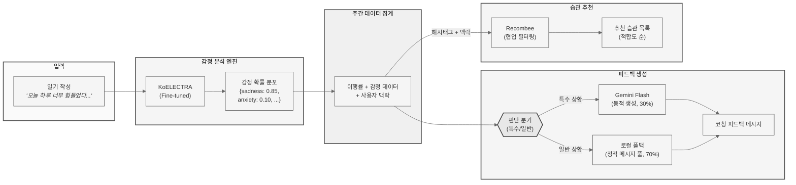

```mermaid
%%{init: {'theme': 'base', 'themeVariables': {'primaryColor': '#F5F5F5', 'primaryBorderColor': '#555555', 'primaryTextColor': '#333333', 'lineColor': '#666666', 'secondaryColor': '#EEEEEE', 'tertiaryColor': '#FAFAFA', 'fontSize': '14px'}}}%%

flowchart LR
    subgraph INPUT["입력"]
        A["일기 작성<br/><i>'오늘 하루 너무 힘들었다...'</i>"]
    end

    subgraph EMOTION["감정 분석 엔진"]
        B["KoELECTRA<br/>(Fine-tuned)"]
        B1["감정 확률 분포<br/>{sadness: 0.85,<br/>anxiety: 0.10, ...}"]
        B --> B1
    end

    subgraph AGGREGATE["주간 데이터 집계"]
        C["이행률 + 감정 데이터<br/>+ 사용자 맥락"]
    end

    subgraph FEEDBACK["피드백 생성"]
        direction TB
        D{{"판단 분기<br/>(특수/일반)"}}
        E["Gemini Flash<br/>(동적 생성, 30%)"]
        F["로컬 폴백<br/>(정적 메시지 풀, 70%)"]
        G["코칭 피드백 메시지"]
        D -->|"특수 상황"| E
        D -->|"일반 상황"| F
        E --> G
        F --> G
    end

    subgraph RECOMMEND["습관 추천"]
        H["Recombee<br/>(협업 필터링)"]
        H1["추천 습관 목록<br/>(적합도 순)"]
        H --> H1
    end

    A --> B
    B1 --> C
    C --> D
    C -->|"해시태그 + 맥락"| H

    style INPUT fill:#FAFAFA,stroke:#555555,stroke-width:2px
    style EMOTION fill:#F5F5F5,stroke:#555555,stroke-width:2px
    style AGGREGATE fill:#F0F0F0,stroke:#555555,stroke-width:2px
    style FEEDBACK fill:#F5F5F5,stroke:#555555,stroke-width:2px
    style RECOMMEND fill:#F5F5F5,stroke:#555555,stroke-width:2px
    style D fill:#E8E8E8,stroke:#444444,stroke-width:2px
```
