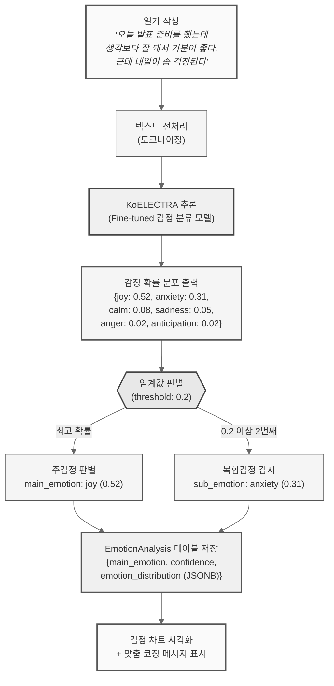

# 감정 분석 모듈 (KoELECTRA)

## 동작 시나리오

## 시나리오 표

| 단계 | 주체 | 동작 | 입력 | 출력 |
|:---:|:---:|:---|:---|:---|
| 1 | 사용자 | 일기 작성 완료 | 텍스트 원문 | - |
| 2 | FastAPI | 텍스트 전처리 | 원문 | 토크나이즈된 입력 |
| 3 | KoELECTRA | 감정 분류 추론 | 토큰 시퀀스 | 6개 감정 확률 분포 |
| 4 | FastAPI | 임계값 판별 | 확률 분포 | 주감정 + 복합감정 |
| 5 | PostgreSQL | 분석 결과 저장 | EmotionAnalysis 객체 | emotion_analysis_id |
| 6 | React Native | 결과 시각화 | JSON 응답 | 감정 차트 + 코칭 메시지 |
