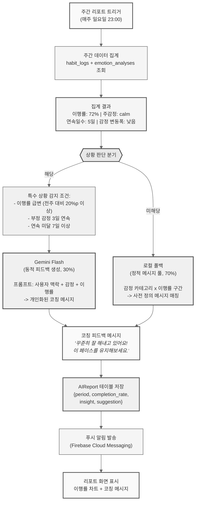

# 피드백 생성 모듈 (Gemini Flash + 로컬 폴백)

## 동작 시나리오

## 시나리오 표

| 단계 | 주체 | 동작 | 입력 | 출력 |
|:---:|:---:|:---|:---|:---|
| 1 | 스케줄러 | 주간 리포트 트리거 | cron (일요일 23:00) | 생성 요청 |
| 2 | FastAPI | 주간 데이터 집계 | user_id + 주간 범위 | 이행률, 감정 평균, 연속일수 |
| 3 | FastAPI | 상황 판단 분기 | 집계 결과 | "특수" 또는 "일반" |
| 4a | Gemini Flash | 동적 피드백 생성 (30%) | 프롬프트 (맥락 + 감정) | 개인화 코칭 메시지 |
| 4b | 로컬 폴백 | 정적 메시지 매칭 (70%) | 감정 x 이행률 구간 | 사전 정의 메시지 |
| 5 | PostgreSQL | 리포트 저장 | AIReport 객체 | ai_report_id |
| 6 | FCM | 푸시 알림 발송 | 알림 내용 | 사용자 단말 전달 |
| 7 | React Native | 리포트 표시 | JSON 응답 | 차트 + 코칭 메시지 |
