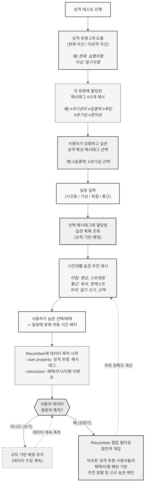

# 습관 추천 모듈 (규칙 기반 매칭 + Recombee 점진적 도입)

## 동작 시나리오: 온보딩 콜드 스타트 -> 웜 스타트 전환

## 시나리오 표

| 단계 | 주체 | 동작 | 입력 | 출력 |
|:---:|:---:|:---|:---|:---|
| 1 | 사용자 | 성격 테스트 진행 | 테스트 응답 | 성격 유형 2개 (현재/이상) |
| 2 | 앱 | 해시태그 제시 | 성격 유형별 해시태그 4-5개 | 해시태그 목록 |
| 3 | 사용자 | 강화 특성 해시태그 선택 | 해시태그 목록 | 선택된 해시태그 |
| 4 | 사용자 | 일정 입력 | 시간표, 기상/취침, 통근 | 가용 시간대 |
| 5 | FastAPI | 규칙 기반 습관 매칭 | 해시태그 -> 습관 매핑 테이블 | 후보 습관 목록 |
| 6 | 앱 | 시간대별 추천 제시 | 습관 목록 + 가용 시간대 | 아침/통근/저녁별 습관 카드 |
| 7 | 사용자 | 습관 채택 | 탭 선택 | 일정 자동 배치 |
| 8 | Recombee | 데이터 축적 | 채택/무시/이행 이벤트 + 성격 유형 | 사용자 프로필 구축 |
| 9 | Recombee | 점진적 개입 (성장기) | 축적된 행동 데이터 | 협업 필터링 기반 정렬/추천 |
