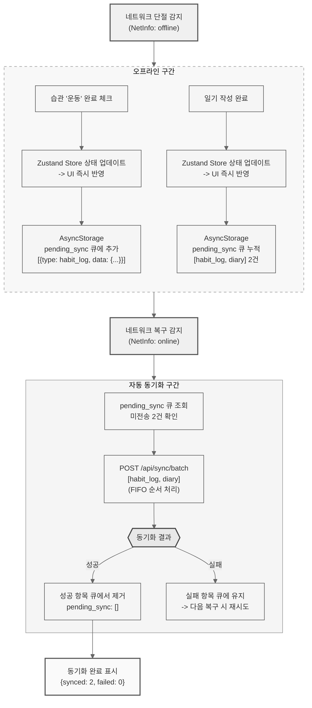

# 오프라인 동기화 모듈 (AsyncStorage + 자동 동기화)

## 동작 시나리오

## 시나리오 표

| 단계 | 주체 | 동작 | 입력 | 출력 |
|:---:|:---:|:---|:---|:---|
| 1 | React Native | 네트워크 단절 감지 | NetInfo 이벤트 | offline 모드 진입 |
| 2 | 사용자 | 습관 체크 / 일기 작성 | 터치 입력 | - |
| 3 | Zustand | 로컬 상태 업데이트 | 변경 데이터 | UI 즉시 반영 |
| 4 | AsyncStorage | pending_sync 큐 적재 | 변경 항목 | 큐 누적 (FIFO) |
| 5 | React Native | 네트워크 복구 감지 | NetInfo 이벤트 | online 모드 전환 |
| 6 | React Native | 큐 조회 + 배치 전송 | pending_sync | POST /api/sync/batch |
| 7 | FastAPI | 트랜잭션 처리 | 배치 데이터 | 항목별 성공/실패 |
| 8 | AsyncStorage | 큐 정리 | 동기화 결과 | 성공 제거, 실패 유지 |
