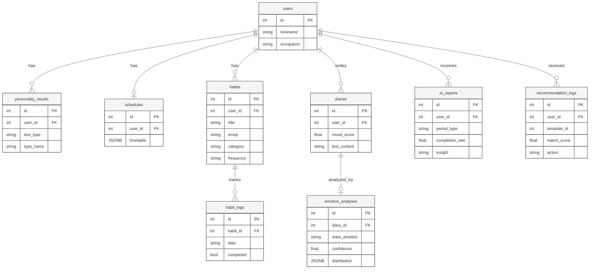

```mermaid
%%{init: {'theme': 'base', 'themeVariables': {'primaryColor': '#F5F5F5', 'primaryBorderColor': '#555', 'primaryTextColor': '#333', 'lineColor': '#666', 'fontSize': '13px'}}}%%

erDiagram
    users {
        int id PK
        string nickname
        string occupation
    }

    personality_results {
        int id PK
        int user_id FK
        string test_type
        string type_name
    }

    schedules {
        int id PK
        int user_id FK
        JSONB timetable
    }

    habits {
        int id PK
        int user_id FK
        string title
        string emoji
        string category
        string frequency
    }

    habit_logs {
        int id PK
        int habit_id FK
        string date
        bool completed
    }

    diaries {
        int id PK
        int user_id FK
        float mood_score
        string text_content
    }

    emotion_analyses {
        int id PK
        int diary_id FK
        string main_emotion
        float confidence
        JSONB distribution
    }

    ai_reports {
        int id PK
        int user_id FK
        string period_type
        float completion_rate
        string insight
    }

    recommendation_logs {
        int id PK
        int user_id FK
        int template_id
        float match_score
        string action
    }

    users ||--o{ personality_results : "has"
    users ||--o| schedules : "has"
    users ||--o{ habits : "has"
    users ||--o{ diaries : "writes"
    users ||--o{ ai_reports : "receives"
    users ||--o{ recommendation_logs : "receives"
    habits ||--o{ habit_logs : "tracks"
    diaries ||--o| emotion_analyses : "analyzed_by"
```
