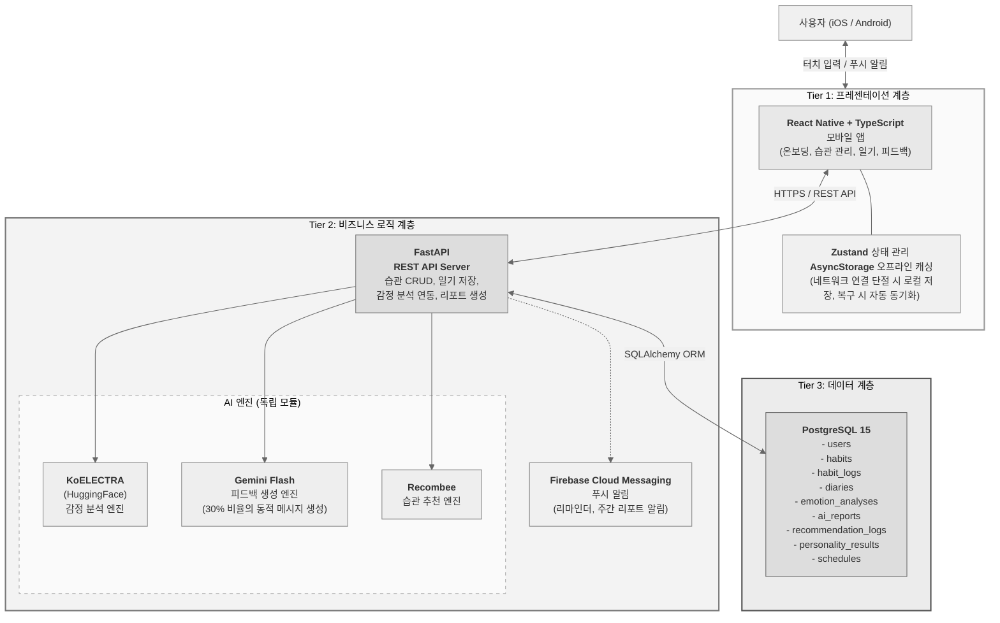

```mermaid
%%{init: {'theme': 'base', 'themeVariables': {'primaryColor': '#F0F0F0', 'primaryBorderColor': '#888', 'primaryTextColor': '#333', 'lineColor': '#666', 'fontSize': '14px'}}}%%

flowchart TB
    USER["사용자 (iOS / Android)"]

    subgraph TIER1["Tier 1: 프레젠테이션 계층"]
        direction TB
        APP["<b>React Native + TypeScript</b><br/>모바일 앱<br/>(온보딩, 습관 관리, 일기, 피드백)"]
        STORE["<b>Zustand</b> 상태 관리 <b>AsyncStorage</b> 오프라인 캐싱<br/>(네트워크 연결 단절 시 로컬 저장, 복구 시 자동 동기화)"]
        APP --- STORE
    end

    subgraph TIER2["Tier 2: 비즈니스 로직 계층"]
        direction TB
        API["<b>FastAPI <br>REST API Server</b><br/>습관 CRUD, 일기 저장, <br/>감정 분석 연동, 리포트 생성"]

        subgraph AI["AI 엔진 (독립 모듈)"]
            KO["<b>KoELECTRA</b><br/>(HuggingFace)<br>감정 분석 엔진"]
            GEM["<b>Gemini Flash</b><br/>피드백 생성 엔진<br/>(30% 비율의 동적 메시지 생성)"]
            REC["<b>Recombee</b><br/>습관 추천 엔진"]
        end

        FCM["<b>Firebase Cloud Messaging</b><br/>푸시 알림<br> (리마인더, 주간 리포트 알림)"]

        API --> KO
        API --> GEM
        API --> REC
        API -.-> FCM
    end

    subgraph TIER3["Tier 3: 데이터 계층"]
        DB["<b>PostgreSQL 15</b> <br/>- users<br/>- habits<br/>- habit_logs<br/>- diaries<br/>- emotion_analyses<br/>- ai_reports<br/>- recommendation_logs<br/>- personality_results<br/>- schedules"]
    end

    USER <-->|"터치 입력 / 푸시 알림"| TIER1
    APP <-->|"HTTPS / REST API"| API
    API <-->|"SQLAlchemy ORM"| DB

    style TIER1 fill:#FAFAFA,stroke:#999,stroke-width:2px
    style TIER2 fill:#F3F3F3,stroke:#777,stroke-width:2px
    style AI fill:#FAFAFA,stroke:#AAA,stroke-width:1px,stroke-dasharray: 5 5
    style TIER3 fill:#ECECEC,stroke:#555,stroke-width:2px
    style APP fill:#E8E8E8,stroke:#888
    style STORE fill:#F0F0F0,stroke:#888
    style API fill:#DDD,stroke:#777
    style KO fill:#EEE,stroke:#888
    style GEM fill:#EEE,stroke:#888
    style REC fill:#EEE,stroke:#888
    style FCM fill:#F0F0F0,stroke:#888
    style DB fill:#DDD,stroke:#666
    style USER fill:#F0F0F0,stroke:#999
```
